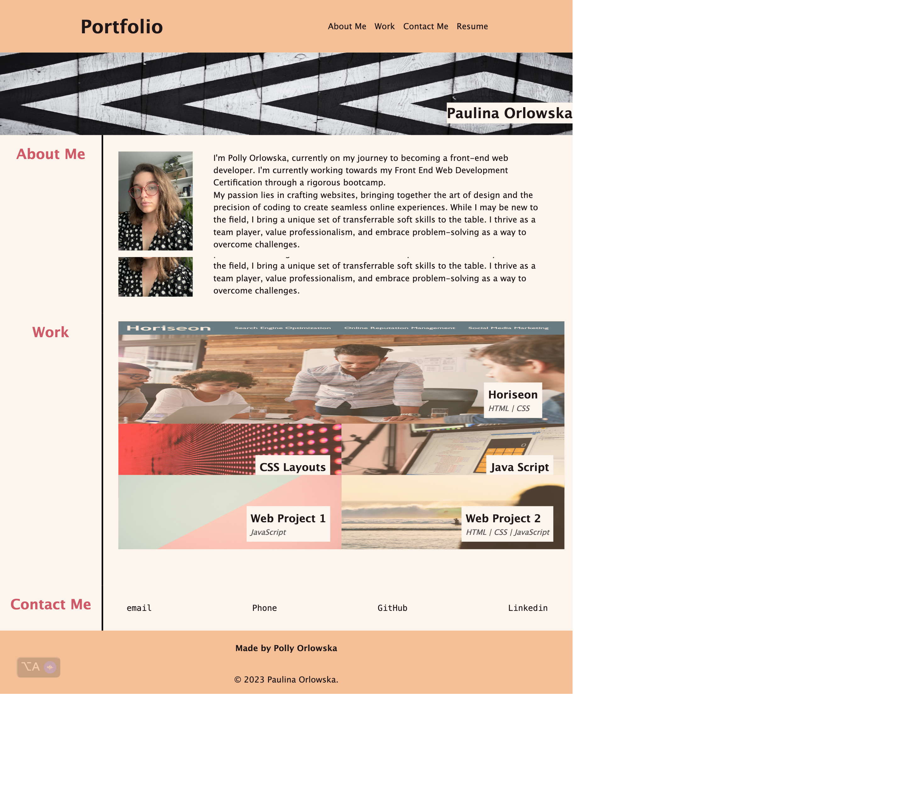

# Bootstrap-Portfolio
Personal portfolio using the Bootstrap CSS Framework

## Description 

This project aimed to develop and deploy an draft porfolio using Bootstrap framework for future use of our web development journey. 
This Portfolio contains and outline of the author, thir projects ( more can be added in the future) with links to the deployed appliactions, their set of skills, as well as their contact info.

It allowes the author to keep all project in one place and have easy access to them at any time. 

This appilcation can be used by the author to showcase their skills to future emplyers while applaying for job, as well as showcase the projects that has been done. 

This project was created with accessibility and different types of devices in mind (responsicness), so it can be viewed in multiple devices. This was done with use of Bootstrap 5 classes and column design, the with Custom CSS - to finish of the design to resemble previous portfolio.

## Installation

This apploaction can be viewed via any browser. 
Deployed using GitHub.

To access the webpage please follow [THIS LINK](https://porlowska.github.io/Bootstrap-Portfolio/).

## Usage 

This application can be used to showcase skills and project to the future employers or colleagues, as well as it is easy accessible place to store any showcase worth project. 

## Credits

Previously deployed [Portfolio](https://porlowska.github.io/porlowska-portfolio/).

Knowleade acquired throughout bootcamp creating projects. 

additialnal images created by the Author using canva.com

colour scheme chosen with help of: https://colorhunt.co/

 [BOOTSTRAP Framework](https://getbootstrap.com/docs/5.3/getting-started/introduction/)

## License
MIT License
